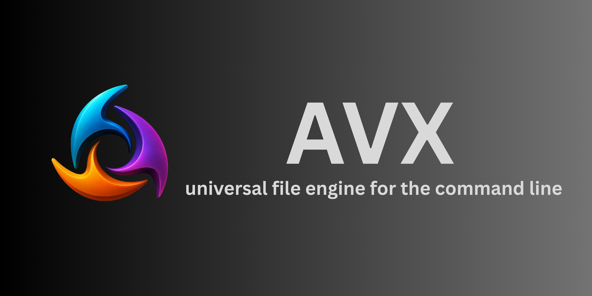

# AVX - Universal File Conversion CLI Engine



> **AVX** is a powerful, open-source **file conversion tool** and universal **file management CLI engine** for transforming documents, images, audio, video, and data files across multiple formats.

## What is AVX?

AVX (Advanced eXtensible Engine) is an open-source **universal file conversion platform** designed for developers, data engineers, and automation specialists. It provides a command-line interface for converting files between numerous supported formats including **PDF conversion, image format conversion, audio transcoding, video transformation, and data format parsing**.

Whether you need to convert **DOCX to PDF**, **PNG to JPG**, **WAV to MP3**, **CSV to JSON**, or any other file format conversion, AVX delivers a unified CLI solution without juggling multiple tools.

### Key Capabilities

- **File Format Conversion**: Convert documents, images, audio, video, and data files seamlessly
- **Document Conversion**: Transform DOCX, PPTX, XLSX to PDF and other formats
- **Image Processing**: Convert between PNG, JPG, GIF, WEBP and other image formats
- **Audio & Video**: Transcode audio (MP3, WAV, FLAC, AAC) and video formats
- **Data Transformation**: Parse and convert CSV, JSON, XML, and other data formats
- **Cross-Platform CLI**: Works on Windows, macOS, Linux, and FreeBSD
- **Python-Based**: Fully customizable and extensible file conversion engine

### How AVX Works

AVX uses a universal routing map system that intelligently directs file conversion workflows. It integrates with industry-standard binaries like **FFmpeg** (for audio/video), **Pandoc** (for document conversion), and **Pillow** (for image processing). The engine provides a clean CLI interface that abstracts away the complexity of these tools.

Whether you're building data pipelines, automating file workflows, or managing bulk file conversions, AVX handles the heavy lifting with a single command.

The AVX project is maintained by an active open-source community and continues to expand its format support and conversion capabilities.

## Why Choose AVX for File Conversion?

- ✅ **No Dependencies Bloat** - Standalone binary available (no Python required)
- ✅ **Universal Format Support** - Convert 100+ file formats with one tool
- ✅ **Developer Friendly** - Easy CLI syntax, perfect for automation and scripts
- ✅ **Production Ready** - Used in data pipelines and enterprise workflows
- ✅ **Active Community** - Continuously maintained and updated with new format support
- ✅ **MIT License** - Free to use and modify for any project

## Getting Started: Installation

### Option 1: One-Line Installation (Standalone Binary)
This method downloads the pre-compiled standalone executable, so you do not need Python on your machine.

**For Unix / macOS / Linux:**
```bash
curl -fsSL https://raw.githubusercontent.com/Aryan-202/avx/main/scripts/install.sh | bash
```

**For Windows (PowerShell):**
```powershell
irm https://raw.githubusercontent.com/Aryan-202/avx/main/scripts/install.ps1 | iex
```

**For Windows (Command Prompt):**
```cmd
curl -sL https://raw.githubusercontent.com/Aryan-202/avx/main/scripts/install.bat -o install.bat && install.bat && del install.bat
```

### Option 2: Python Package Manager
If you prefer managing AVX via Python (and have Python installed), you can install it directly from PyPI:
```bash
pip install avx
```
Alternatively, for an isolated installation, you can use `uv` or `pipx`:
```bash
uv tool install avx
# OR
pipx install avx
```

## License

AVX is released under the **MIT License**, allowing for robust modification and open collaboration. This means you can use, modify, and distribute AVX freely. Certain domain conversion functionalities may rely on installed external libraries and utilities (like **LibreOffice** or **FFmpeg**) which retain their own specific licenses.

The core conversion engine logic can be freely imported into any 3rd-party Python application, CLI tool, or data processing pipeline.

## Supported Platforms & Environments

AVX is available and actively tested on the following **cross-platform environments** supporting Python (3.9+):

* **Windows** (10 and later, including modern PowerShell workflows)
* **macOS** (10.15 and later)
* **GNU/Linux** and affiliated distributions
* **FreeBSD** and affiliated systems

Not all plugin pathways receive the same level of care; however, the built-in universal rule engine is built to gracefully handle and report unsupported format shifts safely to the CLI. Support for additional formats and platforms is continuously added by the community.

## Use Cases for AVX File Conversion

### Ideal For:
- **Data Engineers** - Automate data format conversions in ETL pipelines
- **DevOps Teams** - Convert file formats in deployment workflows
- **Content Creators** - Batch convert images, audio, and video formats
- **System Administrators** - Centralized file conversion on servers
- **Python Developers** - Embed AVX in custom applications
- **Automation Specialists** - Build file conversion workflows and scripts

## Contributing to AVX - Open Source File Conversion Engine

AVX is maintained entirely by an **open-source community** of developers who are passionate about building a foundational file conversion tool. This includes developers, maintainers, technical writers, and enthusiasts who want to expand AVX into a industry standard.

### Architecture & Development

The main development of AVX is structured strictly in **Python**. The repository isolates CLI processing logic from actual format manipulation execution, adhering closely to **modular design principles** for easy extension and maintenance.

### How to Contribute

We actively need help with the following tasks to expand AVX:

* **Coding Conversion Plugins** - Build new conversion domain plugins (Audio, Archives, Images, Data, Documents)
* **Packaging & Distribution** - Package the standalone AVX executable for seamless distribution across native package managers (apt, brew, winget, scoop)
* **Technical Documentation** - Create and improve user-facing documentation and guides
* **Testing & Quality** - Expand test coverage for edge-cases within external binaries and conversion workflows
* **Community Support** - Provide community support and help with issue triage
* **Performance Optimization** - Optimize file conversion speed and memory usage

Please contribute and help expand the AVX project ecosystem! Your contributions make file conversion accessible to everyone.

### Contribution Process
Contributions are natively processed through Pull Requests on our primary Git repository.

Continuous Integration pipelines should succeed, and architectural or feature discussions should be completely resolved, before any code is approved and merged into the main development branch.

## AVX Engine Architecture & Technical Details

### Universal File Conversion Engine

The **AVX Native Engine** is fundamentally an embeddable file processing manager designed for integration into 3rd-party applications and automated scripts. It runs consistently across all supported platforms, providing:

- **Programmatic conversion sequences** - Chain multiple file conversions
- **Metadata extraction** - Extract file metadata and properties
- **Directory tree analytics** - Batch analyze and convert file structures
- **Format routing** - Intelligent format detection and conversion routing

The engine strictly relies on a **domain-driven architectural design** — keeping **document transformations** safely decoupled from **image transcoding** or **audio manipulation** modules. This modular approach ensures:

- ✅ Easy to maintain and extend
- ✅ Reduced dependency conflicts
- ✅ Better performance per domain
- ✅ Easier testing and debugging

### Integration with External Tools

AVX integrates seamlessly with industry-standard conversion tools:
- **FFmpeg** - Audio and video conversion
- **Pandoc** - Document and markup conversion
- **Pillow** - Image format conversion and manipulation
- **LibreOffice** - Advanced document processing

## Resources & Documentation

* `docs/commands.md` - Commands Overview and CLI Flag Index
* `docs/TODO.md` - Future Architectures, Engine Goals, and the Domain Roadmap

## Source Code Sitemap
```text
commands/          - Isolated CLI execution components such as "ls" and "convert"
converters/        - Format specific integration plugins and specialized handles
docs/              - Architecture references, design roadmaps, and guides

cli.py             - Primary execution entrypoint and tool router
README.md          - Project summary and high-level abstract
```
